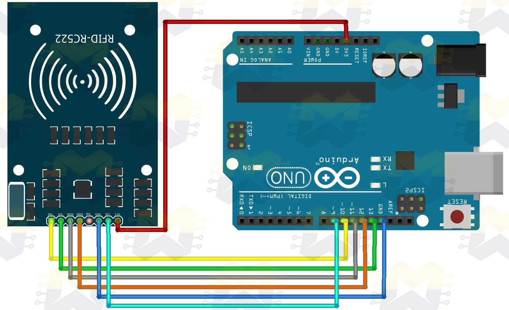
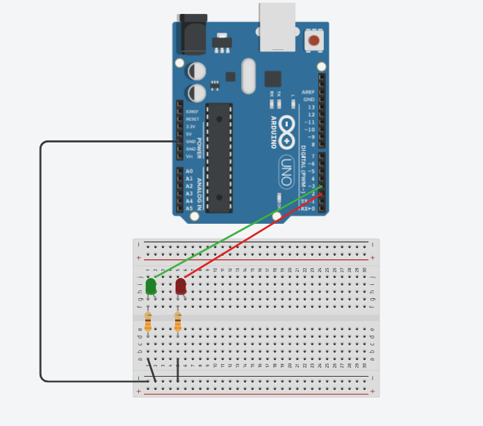
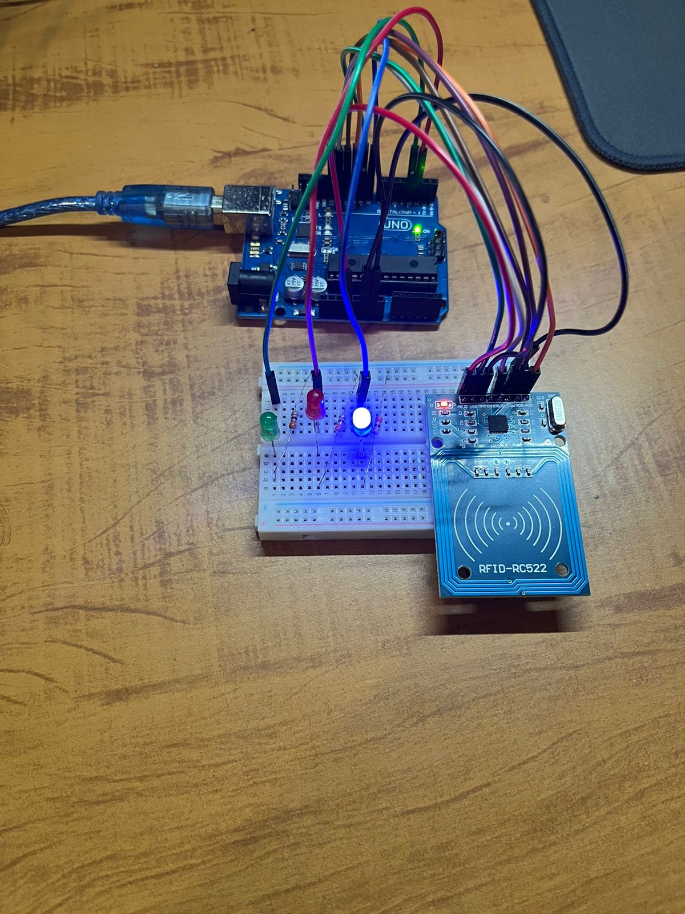
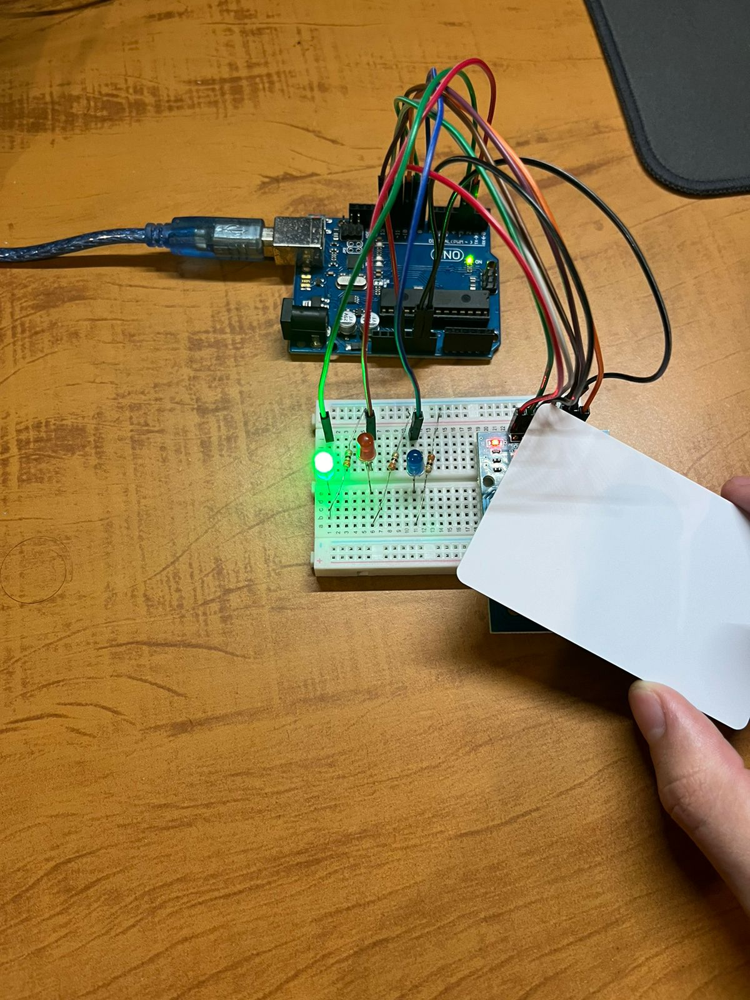
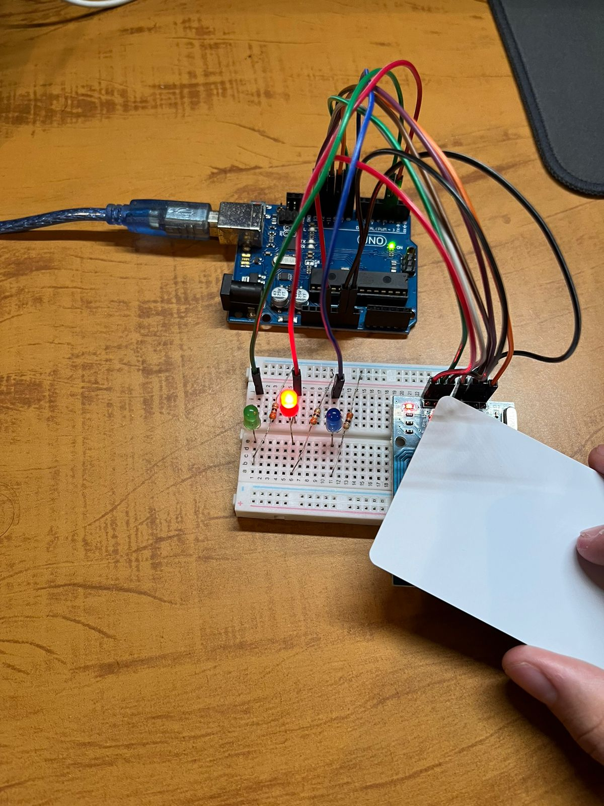

# Catraca-RFID

## Software
No código utilizamos a biblioteca MFRC522.h, SPI.h e Wire.h para poder comunicar com a placa RC522 (placa RFID utilizada no circuito). Ele possui 4 funções: setup (função padrão do arduino na qual configuramos os pinos e inicializamos bibliotecas), loop (função que executa o código principal, também padrão do arduino), formatar_id (formata o valor lido pela placa para o formato do id padrão) e leituraRFID (função que lê o cartão RFID). O código pode ser encontrado aqui no repositório com o nome main.ino.

O código foi baseado no código do [Blogmasterworkshop](https://www.google.com/url?sa=t&source=web&rct=j&opi=89978449&url=https://blogmasterwalkershop.com.br/arduino/como-usar-com-arduino-kit-rfid-mfrc522&ved=2ahUKEwiQ_ZrxrfeGAxVzrpUCHXTEC98QFnoECBsQAQ&usg=AOvVaw2hHnE6edCcZ1mfguP0Xfla)

## Circuito
Como não foi possível montar no Tinkercad o circuito, pois não havia o componente da placa RFID, encontramos esta imagem que ilustra as ligações da placa com o arduino. Vale ressaltar que no projeto a placa foi encaixada na protoboard e as conexṍes foram feitas através dela.
  

###### Crédito: [blogmasterworkshop](https://blogmasterwalkershop.com.br/wp-content/uploads/2018/06/img01_como_usar_com_arduino_-_kit_rfid_mfrc522_uno_mega_2560_nano_controle_acesso_automacao_residencial.jpg)

Segue agora o circuito das ligações dos leds com o arduino. Tanto esse circuito quanto o acima foram feitos na mesma protoboard.

## Imagens do projeto

### Catraca aguardando para ler um cartão que será o cartáo permitido

### Catraca liberada

### Catraca bloqueada

## Vídeo
O vídeo de funcionamento pode ser acessado pelo seguinte link: [Projeto Catraca RFID](https://youtu.be/XERBfMdBD_g)

## Alunos
Augusto Fernandes Ildefonso [(Github)](https://github.com/Augusto-Ildefonso) 

Lucas Alves da Silva [(Github)](https://github.com/lucassilvausp) 

Marcelo Caporalli Filho [(Github)](https://github.com/MarceloCFilho) 

Marco Tulio Mello Silva [(Github)](https://github.com/Marco-Normal)
